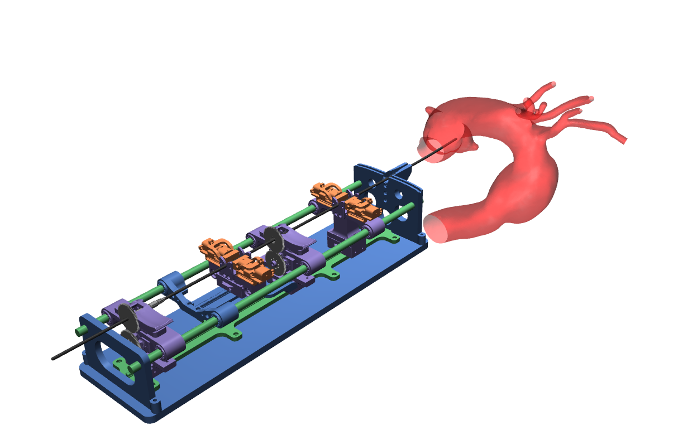

# CathSim



## Installation Procedure

1. Install the environment

```bash
git clone -b git@github.com:tudorjnu/cathsim.git
cd cathsim
pip install -e .
```

## Citation
```
@article{jianu2022cathsim,
  title={CathSim: An Open-source Simulator for Autonomous Cannulation},
  author={Jianu, Tudor and Huang, Baoru and Abdelaziz, Mohamed EMK and Vu, Minh Nhat and Fichera, Sebastiano and Lee, Chun-Yi and Berthet-Rayne, Pierre and Nguyen, Anh and others},
  journal={arXiv preprint arXiv:2208.01455},
  year={2022}
}
```


